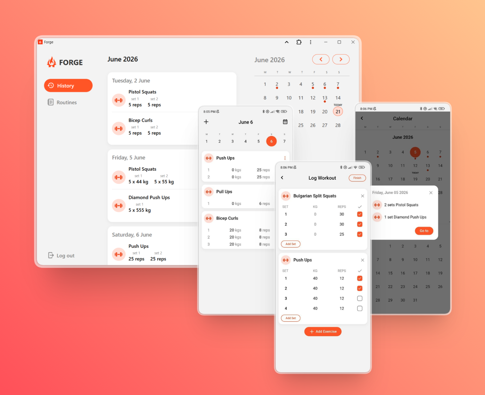
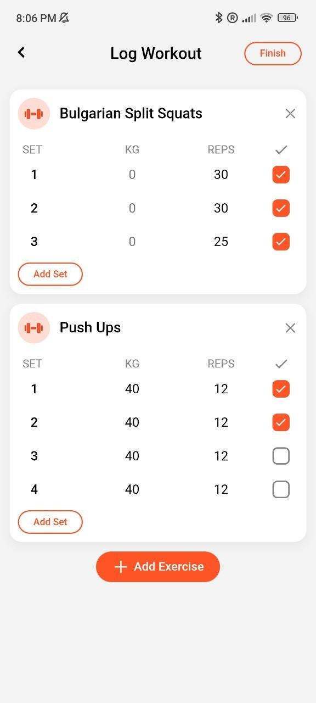

<div align="center">

 
<h1 style="display:inline">Forge</h1>

This is a lightweight and simple PWA for logging workouts, with offline-first architecture and cross-device sync.

[](https://pwa-workout-tracker-2ymf.vercel.app)

<br/>



</div>

---

## ✨ Features

- 📋 **Workout Logging** — Log exercises with sets, reps, and weight *(mobile)*
- 🗓️ **Calendar** — Navigate your training history day by day
- 💪 **Routines** — Create, edit, and start workout templates *(mobile & desktop)*
- 📲 **Install as App** — Works offline, installable on any device as a PWA
- 🔄 **Cross-device Sync** — Keeps your data consistent across all your devices
- ✈️ **Offline First** — Fully functional without internet; sync happens when connection is available

> 💡 **Desktop** is a companion experience — view history and manage routines. Workout logging is optimized for mobile.

---

## 📱 Screenshots

| Home — Daily Log | Log Workout — Routines |
|:---:|:---:|
|  |  |

---

## 🚀 Getting Started

### Use it instantly
👉 **[Open in Browser](https://pwa-workout-tracker-2ymf.vercel.app)** — no install needed

### Install as PWA
1. Open the app in Chrome or Safari
2. Click **"Add to Home Screen"** (mobile) or **"Install"** (desktop)
3. Done — works offline from now on

---

## 🛠️ Run Locally

```bash
# Clone the repo
git clone https://github.com/ElmiraZeynalova/pwa-workout-tracker.git
cd workout_tracker

# Install dependencies
npm install

# Start dev server
npm run dev
```

Open [http://localhost:5173](http://localhost:5173) in your browser.

### Build for production

```bash
npm run build
npm run preview
```

---

## 🧱 Tech Stack

| Technology | Purpose |
|---|---|
| **React 19 (TypeScript)** | UI framework |
| **Vite** | Build tool |
| **vite-plugin-pwa** | Offline support & installability |
| **IndexedDB** | Local Data Base |
| **CSS** | Styling |
| **Supabase** | Database & real-time sync |
| **Supabase Auth (OTP)** | Passwordless email authentication |

---

## 🤝 Contributing

Any contributions you make are greatly appreciated. Feel free to open an issue or submit a pull request.

If you have a suggestion that would make this better, please fork the repo and create a pull request. You can also simply open an issue with the tag "enhancement". Don't forget to give the project a star!

1. Fork the project
2. Create your feature branch: `git checkout -b feature/my-feature`
3. Commit your changes: `git commit -m 'Add my feature'`
4. Push to the branch: `git push origin feature/my-feature`
5. Open a Pull Request

---

## 📄 License

MIT License — feel free to use and modify.

---

## Contact

Elmira Zeynalova - elmirazeynalova39@gmail.com

---
