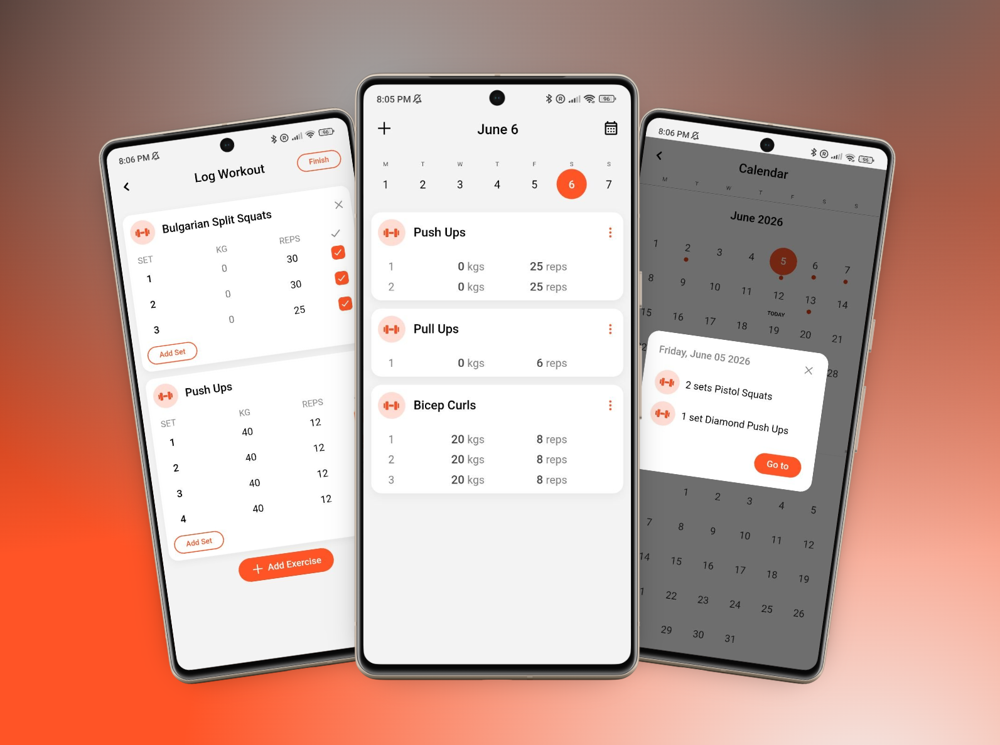

<div align="center">

# 🏋️ Forge

**Track your workouts. Build your strength.**

A lightweight Progressive Web App for logging workouts, tracking progress, and building routines — no account needed.

[](https://your-vercel-url.vercel.app)
[](https://your-vercel-url.vercel.app)
[](https://react.dev)

<br/>



</div>

---

## ✨ Features

- 📋 **Workout Logging** — Log exercises with sets, reps, and weight for any day
- 🗓️ **Weekly Calendar** — Navigate your training history day by day
- 💪 **Routines** — Create and start pre-built routines (Full Body, Upper Body, Lower Body, etc.)
- 📲 **Install as App** — Works offline, installable on any device as a PWA
- 🔄 **Cross-device Sync** — Optional account to keep your data consistent across all your devices
- ✈️ **Offline First** — Fully functional without internet; sync happens when connection is available

---

## 📱 Screenshots

| Home — Daily Log | Log Workout — Routines |
|:---:|:---:|
|  |  |

---

## 🚀 Getting Started

### Use it instantly
👉 **[Open in Browser](https://your-vercel-url.vercel.app)** — no install needed

### Install as PWA
1. Open the app in Chrome or Safari
2. Click **"Add to Home Screen"** (mobile) or **"Install"** (desktop)
3. Done — works offline from now on

---

## 🛠️ Run Locally

```bash
# Clone the repo
git clone https://github.com/your-username/forge.git
cd forge

# Install dependencies
npm install

# Start dev server
npm run dev
```

Open [http://localhost:5173](http://localhost:5173) in your browser.

### Build for production

```bash
npm run build
npm run preview
```

---

## 🧱 Tech Stack

| Technology | Purpose |
|---|---|
| **React 18** | UI framework |
| **Vite** | Build tool |
| **PWA (Workbox)** | Offline support & installability |
| **LocalStorage** | Client-side data persistence |
| **CSS / Tailwind** | Styling |
| **Node.js / Express** | Sync server |
| **JWT / Auth** | User authentication for cross-device sync |

---

## 📁 Project Structure

```
forge/
├── public/
│   ├── manifest.json       # PWA manifest
│   └── icons/              # App icons
├── src/
│   ├── components/         # UI components
│   ├── pages/              # App screens
│   ├── hooks/              # Custom React hooks
│   └── utils/              # Helpers & storage logic
└── vite.config.js
```

---

## 🤝 Contributing

Contributions are welcome! Feel free to open an issue or submit a pull request.

1. Fork the project
2. Create your feature branch: `git checkout -b feature/my-feature`
3. Commit your changes: `git commit -m 'Add my feature'`
4. Push to the branch: `git push origin feature/my-feature`
5. Open a Pull Request

---

## 📄 License

MIT License — feel free to use and modify.

---

<div align="center">

Made with 🧡 by [your name](https://github.com/your-username)

</div>
