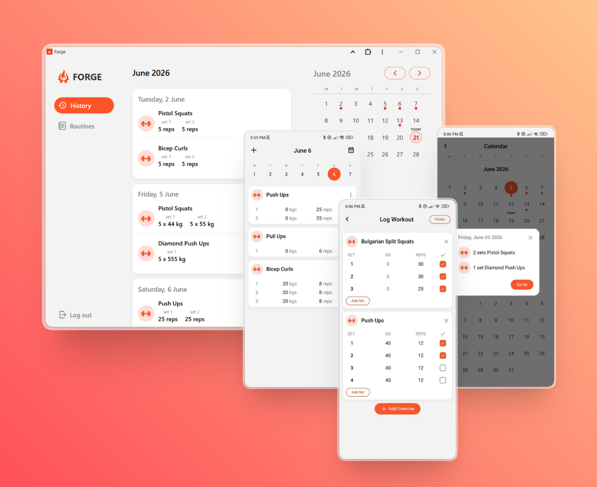

<div align="center">

 
<h1 style="display:inline">Forge</h1>

Forge is an offline-first workout tracking PWA built with React, TypeScript, Node.js, and PostgreSQL. It supports local data storage, cross-device synchronization, authentication, and installable PWA functionality.

[](https://pwa-workout-tracker-2ymf.vercel.app/landing)

<br/>



</div>

---

## ✨ Features

* 📋 **Workout Logging** — Log exercises with sets, reps, and weight
* 🗓️ **Workout History** — Browse training history through an interactive calendar
* 💪 **Routines** — Create, edit, and start reusable workout templates
* 📲 **Progressive Web App** — Installable on mobile and desktop with offline support
* ✈️ **Offline-First Data** — Workout data remains available without an internet connection
* 🔄 **Cross-Device Sync** — Synchronize locally stored workouts with the backend when connectivity is restored
* 🔐 **Authentication** — JWT authentication with short-lived access tokens and rotating refresh tokens stored in HTTP-only cookies
* 📱 **Responsive UI** — Mobile-first workout logging with desktop support for history and routine management

> 💡 **Desktop** is a companion experience — view history and manage routines. Workout logging is optimized for mobile.

---

## 🧩 Technical Highlights

* Designed an **offline-first data flow** using IndexedDB as the local source of data with background synchronization to the backend.
* Implemented **cross-device synchronization** between local client data and PostgreSQL.
* Built a REST API with **Node.js and Express** and integrated PostgreSQL through Prisma.
* Implemented **JWT-based authentication** with short-lived access tokens, rotating refresh tokens, HTTP-only cookies, and server-side session storage.
* Added automatic access token renewal through Axios interceptors when the access token expires.
* Added **PWA support** with service worker caching and installability.
* Handled online/offline transitions and synchronization of locally created and modified workout data.
* Used **TypeScript** across the frontend and backend to improve type safety.

---

## 🛠️ Tech Stack

| Technology                  | Purpose                               |
| --------------------------- | ------------------------------------- |
| **React 19 + TypeScript**   | Frontend UI                           |
| **Vite**                    | Frontend build tool                   |
| **CSS**                     | Styling and responsive UI             |
| **Zustand**                 | Client-side state management          |
| **IndexedDB**               | Local storage for offline-first data  |
| **vite-plugin-pwa**         | Service worker and PWA functionality  |
| **Node.js + Express**       | REST API backend                      |
| **Prisma**                  | ORM and database access               |
| **PostgreSQL (Supabase)**   | Persistent database                   |
| **JWT + HTTP-only Cookies** | Authentication and session management |
| **Vercel / Render**         | Frontend / backend deployment         |

---

## 🚀 Getting Started

### Use it instantly
👉 **[Open in Browser](https://pwa-workout-tracker-2ymf.vercel.app/landing)** — no install needed

### Install as PWA
1. Open the app in Chrome or Safari
2. Click **"Add to Home Screen"** (mobile) or **"Install"** (desktop)
3. Done — works offline from now on

---

## 🛠️ Run Locally

```bash
# Clone the repo
git clone https://github.com/ElmiraZeynalova/pwa-workout-tracker.git
cd workout_tracker

# Install dependencies
npm install

# Start dev server
npm run dev
```

Open [http://localhost:5173](http://localhost:5173) in your browser.

### Build for production

```bash
npm run build
npm run preview
```

---

## 📄 License

MIT License

---

## Contact

Elmira Zeynalova - elmirazeynalova39@gmail.com

---
